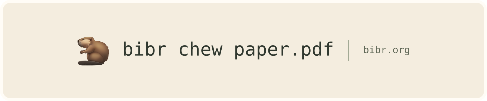

# [](https://bibr.org)

<!-- badges: start -->
[](https://pypi.org/project/bibr/)
[](https://bibr.org)
[](https://www.gnu.org/licenses/agpl-3.0)

[](https://lifecycle.r-lib.org/articles/stages.html#experimental)
[](https://codecov.io/gh/scienceverse/bibr)
<!-- badges: end -->

**bib**liography **r**odent 🦫 - a modern scientific extraction pipeline. Chews through papers, powered by open source and Metascience. Originally built for [Metacheck](https://github.com/scienceverse/metacheck) with accuracy as a priority.

- Reads PDF, DOCX, JATS XML, HTML, and ePub.
- Extracts metadata, references, full text, tables, figures, and equations into a
  [versioned JSON format](https://bibr.org/reference/schema/).
- Includes sentence and page references to help check extractions against the source.
- Works through the CLI, Python, an HTTP API, a web demo, or MCP.
- Lets you choose local or cloud models, limit page ranges, and skip extraction stages.

> [!WARNING]
> **Alpha:** Expect bugs and uneven extraction quality. See [known limitations](LIMITATIONS.md).

## Get started

Requires Python 3.11–3.14, [uv](https://docs.astral.sh/uv/), and the
[system prerequisites](docs/getting-started/install.md#system-prerequisites).
Install from source for now; the PyPI package is a placeholder.

```bash
git clone https://github.com/scienceverse/bibr.git
cd bibr
uv sync --extra all
uv run bibr setup
uv run bibr chew paper.pdf -o result.json
```

The setup wizard detects your hardware, configures OCR and the LLM, and offers to
install any additional dependencies. See the [tester guide](docs/tester-guide.md)
for platform-specific instructions.

## Usage

### Command line

```bash
uv run bibr chew papers/ -o results/   # Process a directory
uv run bibr chew paper.pdf --dry-run   # Preview the processing plan
uv run bibr demo                      # Open the local web demo
```

References are parsed locally by default. Use `--refs llm` to parse them with the
LLM, or `--refs off` to skip them. More options: [CLI reference](https://bibr.org/reference/cli/).

### Python

```python
import bibr

result = bibr.chew("paper.pdf")
print(result.title)
references = result.references.df  # pandas DataFrame
result.save("result.json")
```

See the [Python guide](https://bibr.org/guides/library/) for batch processing and
reusing loaded models with `bibr.Chewer`.

## LLM use

bibr uses LLMs selectively for tasks such as front-page metadata, with support
for small models tuned for extraction. You can disable downstream LLM extraction
with `--no-llm`, which returns structural output; PDF OCR may still use a
vision-language model. The [LLM use note](LLM_POLICY.md) covers these choices
and how agentic LLMs helped develop bibr. It is a work in progress.

## Documentation

- [Configuration](https://bibr.org/guides/configuration/) — OCR, LLMs, reference parsing, and presets.
- [Deployment](https://bibr.org/guides/deployment/) — HTTP API (`bibr serve`), Docker, hardware, and authentication.
- [MCP server](https://bibr.org/guides/mcp/) — extraction tools for agents (`bibr mcp`).
- [JSON schema](https://bibr.org/reference/schema/) and [pipeline architecture](https://bibr.org/guides/architecture/).
- [Evaluating extraction quality](docs/contributing/evaluation.md) on papers from your workflow.

## Contributing

Bug reports, test papers, and contributions are welcome. See
[CONTRIBUTING.md](CONTRIBUTING.md) for development setup, tests, and pull requests.

---

## Acknowledgments

Special thanks to **Daniël Lakens** and **Lisa DeBruine**, for putting faith and patience in the project, and being generous with their time
 to help make bibr 🦫 better for everyone.

Also, to the whole [Metacheck](https://www.scienceverse.org/metacheck/) team, and **TU Eindhoven**.

We are grateful to the open-source projects that bibr builds on:

- [PaddleOCR-VL-1.6](https://huggingface.co/PaddlePaddle/PaddleOCR-VL-1.6) (PaddlePaddle) — default OCR recognizer
- [GLM-OCR](https://huggingface.co/THUDM/GLM-OCR) (THUDM, Tsinghua University) — explicit compatibility backend and fallback
- [GROBID](https://github.com/kermitt2/grobid) — a major source of inspiration for structured scientific document parsing
- [LitServe](https://lightning.ai/docs/litserve/home) (Lightning AI) — serving infrastructure
- [PP-DocLayoutV3](https://github.com/PaddlePaddle/PaddleOCR) (PaddlePaddle) — document layout analysis
- [wtpsplit](https://github.com/segment-any-text/wtpsplit) — sentence segmentation
- [Crossref](https://www.crossref.org/) — reference metadata enrichment

---

## License

[AGPL-3.0-or-later](LICENSE.md).
